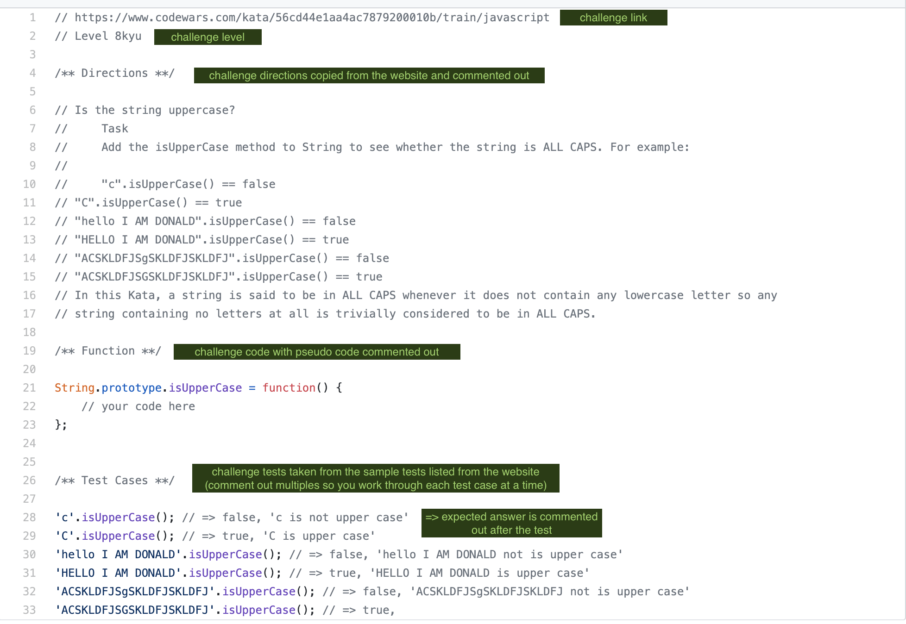

# FHLBC Code Warriors

A selection of leveled challenges to encourage daily coding practice. Initial solutions in Python with extensions in 
Golang, Javascript, and Bash as time permits and if the CodeWars site includes solution checks for those languages.

## Template

Inside each individual challenge, I use the following template:
- link from CodeWars
- kyu level
- directions from CodeWars
- my code
- test cases to prove solution

## Submitting Solutions in CodeWars

Once the solution works locally, I check it against the tests created for the challenge in [CodeWars]
(https://www.codewars.com/) by copying the code from my text editor into the 'Solution:' box. Here is a short video 
explaining that process: [How to Submit Solutions in CodeWars](https://www.youtube.com/watch?v=cDwg6-sUd3I)

## Knowing When to Stop

Sometimes when working through a challenge, I hit a wall. The journey is as important as the destination here, so 
when I reach a frustration point, I may take a break and come back to it. I use this checklist as a guide:
- [ ] Worked for more than 1 - 2 hours
- [ ] Spent 15 minutes (or more) without adding any code
- [ ] Failed more tests than previous attempts (meaning I'm getting further away from a solution)
- [ ] Feelings of defeat, extreme frustration, or low self-esteem
- [ ] Several sessions without a complete solution

